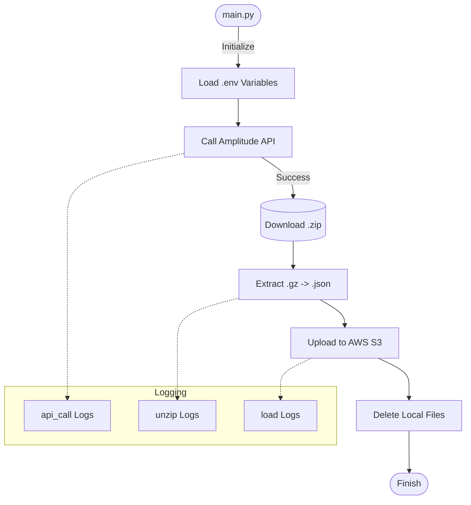

<div align="center">
     
# 🚀 Automated AMP Data Pipeline to S3


<br />

<p>
  <b>A modular EtLT pipeline that fetches daily logs from the Amplitude API, extracts nested JSON data, and uploads it to AWS S3.</b>
</p>

</div>

---

## 📋 Table of Contents
- [Overview](#-overview)
- [Workflow Architecture](#-workflow-architecture)
- [Project Structure](#-project-structure)
- [Prerequisites](#-prerequisites)
- [Environment Configuration](#-environment-configuration)
- [Running the Pipeline](#-running-the-pipeline)

---

## 📖 Overview

This project automates the daily data extraction process. It is designed to be run as a scheduled task (e.g., cron job). The `main.py` script orchestrates the following workflow:

1.  **Extract:** Connects to Amplitude's export API and downloads logs for the previous day.
2.  **Transform:** Unzips the downloaded archive, identifies internal GZIP files, and converts them to JSON.
3.  **Load:** Uploads the processed JSON files to a specific AWS S3 bucket folder (`python-import`).
4.  **Logging:** Generates separate log files for the API call, unzipping, and loading processes for full auditability.

---

## ⚙️ Workflow Architecture



---

## 📂 Project Structure

Ensure your directory is organized as follows for the imports in `main.py` to work correctly:

```text
├── modules/
│   ├── __init__.py       # (Optional, ensures directory is treated as a package)
│   ├── api_call.py       # API connection logic
│   ├── load.py           # S3 upload logic
│   ├── logger.py         # Logging configuration
│   └── unzip_files.py    # File extraction logic
├── main.py               # Orchestrator script
├── .env                  # Secrets (Not committed to Git)
└── requirements.txt      # Dependencies

```

---

## 🛠 Prerequisites

Ensure you have Python installed. Install the required dependencies using pip:

```bash
pip install requests boto3 python-dotenv

```

---

## 🔐 Environment Configuration

Create a `.env` file in the root directory. The application requires **Amplitude** keys (retrieved inside the module) and **AWS** keys (retrieved in `main.py`).

```ini
# .env file

# Amplitude API Credentials
AMP_API_KEY=your_amplitude_api_key
AMP_SECRET_KEY=your_amplitude_secret_key

# AWS S3 Credentials
AWS_ACCESS_KEY=your_aws_access_key
AWS_SECRET_KEY=your_aws_secret_key
BUCKET_NAME=your_s3_bucket_name

```

---

## 🚀 Running the Pipeline

To execute the full process, simply run the main script from your terminal:

```bash
python main.py

```

### Outputs

* **Console:** Real-time status updates and error messages.
* **Logs:** A folder named `api_call_logs`, `unzip_logs`, etc., containing detailed logs of the execution.
* **S3:** JSON files will appear in your bucket under the `python-import/` prefix.

---

<div align="center">
<sub>Built with 💖 using Python</sub>
</div>
